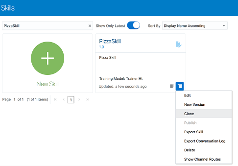
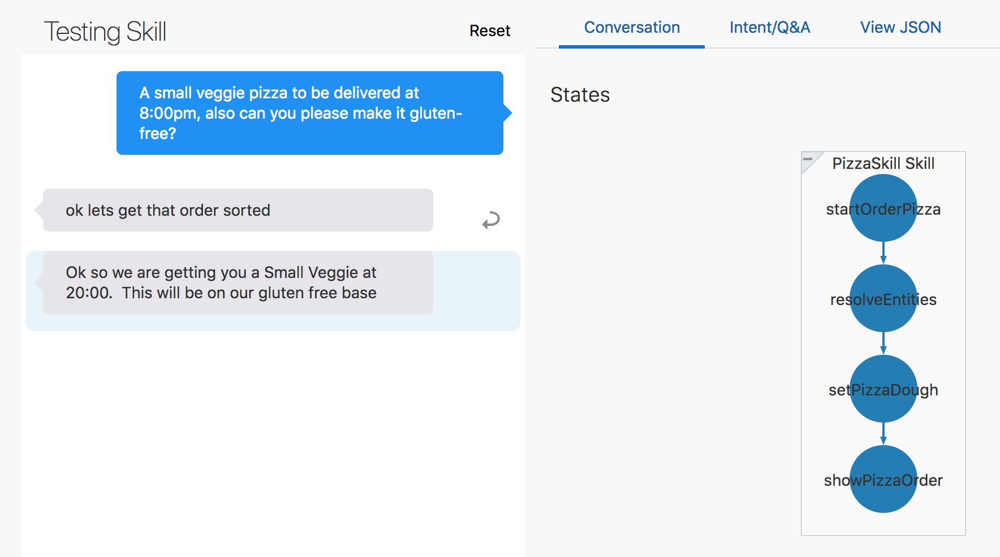
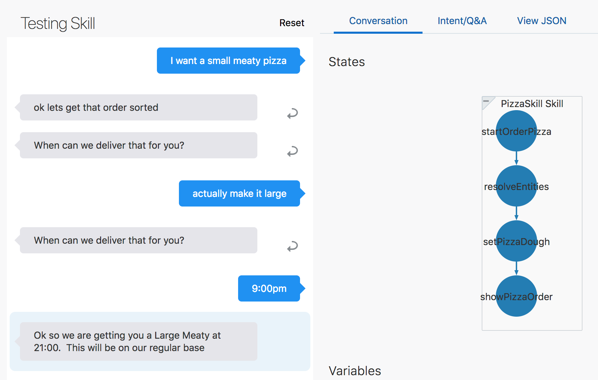

# Digital Assistant - Building a Digital Assistant for your business #

In this lab, you'll learn how to work with skills and digital assistants in Oracle Digital Assistant;
-	A **skill** is an individual chatbot that is focused on a specific set of capabilities (e.g. helping customers order food from a specific restaurant).
- **A digital assistant** is a master chatbot containing multiple specialized skills. When a user engages with the digital assistant, the digital assistant evaluates the user input and routes the conversation to the appropriate skill. You can populate your digital assistant with skills from the Skill Store and with skills you have designed yourself.

## Before you start ##

To complete this lab you need to;

- Download these files
  - [PizzaSkill_starter.zip](https://github.com/KaddeOucif/CTD-Digital-Assistant/blob/master/files/PizzaSkill_starter.zip?raw=true)
  - [PizzaSkill_BotML.json](https://github.com/KaddeOucif/CTD-Digital-Assistant/blob/master/files/PizzaSkill_BotML.json?raw=true)
  - [ODA_CTD2019.zip](https://github.com/KaddeOucif/CTD-Digital-Assistant/blob/master/files/ODA_CTD2019.zip?raw=true)
  - <details><summary> <b>Optional: Download NodeJS & the Web Client SDK to host your Digital Assistant in your machine</b> </summary>
     <b>1.</b> <a href="https://nodejs.org/en/download/">Download NodeJS here</a> <br>
     <b>2.</b> <a href="http://bit.ly/amcedownloads">Download the Web Client SDK here</a> <br>
     <i>Navigate to <b>ODA Client samples for JavaScript v18.4.3.0</b> and download the <b>bots-client-sdk-js-samples-18.4.3.zip</b> file.</i><br>
     </img>
     </details>
 
## Get on crackin'! ##

***

### Login to the shared instance ###
1. In your browser, navigate to http://bit.ly/DAOOW2019.
2. Log in to the instance using the credentials provided by your lab instructor.

After successfully logging in, you will find yourself on the ODA home page.

***

### 1. Clone Copies of the Starter Skill and Digital Assistant ###
In this lab, a starter skill and a starter digital assistant are provided for you. Before you get to work, you need to create your own copies.

#### Clone the Starter Skill ####
1. With the Oracle Digital Assistant UI open in your browser, click  main menu icon to open the side menu.
2. Click **Development** and select **Skills**.
3. Click  again to collapse side menu.
4. In the skills dashboard, find the tile for **PizzaSkill**.
5. Click PizzaSkill's **Options** menu () and select **Clone**.

6. In the **Create Clone** dialog, enter a value for **Display Name** using the form *<your_initials>_PizzaSkill*.
For example, if your initials are AB, you'd name the skill **AB_PizzaSkill**.
7. On the Skills dashboard page, select *<your_initials>_PizzaSkill* to open it up in the designer.

#### Clone the Digital Assistant ####
1. Click  to open the side menu.
2. Click **Development** and select **Digital Assistants**.
3. Click  again to collapse the side menu.
4. In the skills dashboard, find the tile for **ODA_CTD2019**, open its Options menu , and select **Clone**.
5. In the **Create Clone dialog**, enter a value for **Display Name** using the form <your_initials>_CTD_2019.
For example, if your initials are AB, you'd name the skill **AB_CTD_2019**.

6. Click **Clone**.
7. On the Digital Assistants dashboard page, select _<your_initials>_ODA_HOL2019_ to open it up in the designer.

***

### 2. Design your Pizza Skill ###
< Describe what we're doing this lab>

#### Explore the Corpus and test the Skill ####
1. In ODA, click  to open the side menu.
2. Click **Development** and select **Skills**.
3. Click  again to collapse the side menu.
4. In the skills dashboard, select your copy of **PizzaSkill**.
5. In the left navigation for the designer, select the .
6. Click the **OrderPizza** intent and quickly scan the utterances.
7. In the left navigation for the designer, select .
8. Select the **PizzaDough** entity and look at the way that it is configured.
9. Repeat the above step for **PizzaSize** and **PizzaTopping**.
10. Locate the **Train button**  on the right side of the page, click it, click **Submit**, and then wait a few seconds for the training to complete.
11. Find the Skill Tester  in the bottom of the skill's left navigation bar and click it.
12. In the tester's **Message** field, type *I want to order pizza*, click **Send**, and note the skill's response.
For now it's just a static response. It will become more dynamic once we add logic to the dialog flow.

13. Click the **Reset** button at the top of the tester window and then close the tester.

#### Create your Composite Bag and associate the right entities ####

1. Select  and click  to create a new entity.
2. In the **Name** field, change the value to _PizzaBag_.
3. In the Configuration section, in the Type dropdown, select **Composite Bag**.


#### Add the right entity items to your bag ####

1. Click .
2. On the Add Bag Item page, fill in the following values:
- **Name:** PizzaSize
- **Type:** Entity
- **Entity Name:** PizzaSize (If prompted in a popup, select Overwrite.)
- **Maximum User Input Attempts:** 4
- **Error Message:** ```Sorry, '${system.entityToResolve.value.userInput!'this'}' is not a valid size of pizza.```
3. Click .
4. For the value, enter ```What size of pizza would you like?```
5. Again, click .
6. For the value, enter ```Please choose small, medium or large.```
7. Click **Close**.

---

8. Again, click .
9. Click **Close**.
10. On the Add Bag Item page, fill in the following values:
- **Name:** PizzaTopping
- **Type**: Entity
- **Entity Name:** PizzaTopping (If prompted in a popup, select **Overwrite**.)
- **Error Message:** Sorry, we don't have that topping
- **Prompt for Disambiguation:** _switched ON_
- **Disambiguation Prompt:** ```Sorry you can only order one topping type```
11. Click **Close**.

---

12. Again click .
13. On the Add Bag Item page, fill in the following values:
- **Name:** PizzaDough
- **Type:** Entity
- **Entity Name:** PizzaDough
- **Out of Order Extraction:** _switched ON_
- **Prompt for Value:** false
14. Click Close.

---

15. For the fourth (and final) time, click .
16. On the Add Bag Item page, fill in the following values:
- **Name:** DeliveryTime
- **Type:** Entity
- **Entity Name:** TIME
- **Maximum User Input Attempts:** 4
17. Scroll down to the Prompts section, replace the existing prompt with ```When can we deliver that for you?```, and press Enter.
18. Click .
19. In the **Expression** field, enter ```${(pizza.value.DeliveryTime.hrs?number < 10)?then('true','false')}```.
20. In the **Error Message** field, enter ```Sorry, we only deliver up to 9:30pm``` and press the Enter key.
21. Click Close.

---

Here is what the PizzaBag composite bag should look like in the designer:


Now we need to associate the PizzaBag composite entity to the OrderPizza intent so that we can extract the key words and phrases from the user input.

22. Select .
23. Select the **OrderPizza** intent.
24. Click  button and select **PizzaBag** from the dropdown. See this screenshot to help locate the button:


#### Define the logic of your Skill ####

Now we need to define what actions the skills should take depending on the user-input. This is where we choreograph the interaction between the Skill and its end-users. 

1. Paste the YAML-code downloaded previously in [PizzaSkill_BotML.json](https://github.com/KaddeOucif/CTD-Digital-Assistant/blob/master/files/PizzaSkill_BotML.json?raw=true). We won't focus too much on what each segment in the code does in this lab, but let's go through it briefly. You can also find some additional commentary about the flow in the YAML file.

```yaml
#metadata: information about the flow
#  platformVersion: the version of the bots platform that this flow was written to work with 
metadata:
  platformVersion: 1.0
main: true
name: PizzaSkill
#context: Define the variables which will used throughout the dialog flow here.
context:
  variables:
    iResult: "nlpresult"
    pizza: "PizzaBag"
    
states:
  intent:
    component: "System.Intent"
    properties:
      variable: "iResult"
      optionsPrompt: "Do you want to"      
    transitions:
      actions:
        OrderPizza: "startOrderPizza"
        WelcomePizza: "startWelcome"
        unresolvedIntent: "startUnresolved"        

  startOrderPizza:
    component: "System.Output"
    properties:
      text: "ok lets get that order sorted"
      keepTurn: true
    transitions: {}
    
  resolveEntities:
    component: "System.ResolveEntities"
    properties:
      variable: "pizza"
      nlpResultVariable: "iResult"      
      maxPrompts: 3
      cancelPolicy: "immediate"        
    transitions:
      actions:
        cancel: "maxError"
        next: "setPizzaDough"

  setPizzaDough:
    component: "System.SetVariable"
    properties:
      variable: "pizza.PizzaDough"
      # value set for the variable.
      value: "${pizza.value.PizzaDough?has_content?then(pizza.value.PizzaDough,'regular')}"

  showPizzaOrder:
    component: "System.Output"
    properties:
      text: "Ok so we are getting you a ${pizza.value.PizzaSize} ${pizza.value.PizzaTopping} at ${pizza.value.DeliveryTime.date?long?number_to_time?string('HH:mm')}.  This will be on our ${pizza.value.PizzaDough} base "
    transitions: 
      return : "showPizzaOrder"

  startWelcome:
    component: "System.Output"
    properties:
      text: "Hey there - welcome to our online Pizza bot!"
    transitions:
      return: "startWelcome"
      
  startUnresolved:
    component: "System.Output"
    properties:
      text: "Ok lets sort out that pizza for you!"
      keepTurn: false
    transitions:
      return: "startUnresolved"      

  maxError:
    component: "System.Output"
    properties:
      text: "OK lets connect you with someone to help"
    transitions:
      return: "maxError"

  helpState:
    component: "System.Output"
    properties:
      text: "I am the pizza bot here to help you!!"
    transitions:
      return: "helpState"
```

- The **resolveEntities** state calls a system component (System.ResolveEntities), iterates through all the entity fields in the composite bag, converses with the user, and resolves all the fields.
- The **setPizzaDough** state checks if the dough value is null. If yes, then it sets it to regular.
Once all the entities are resolved, we output the pizza details in the showPizzaOrder state.
- The **maxError** state is called if the number of attempts for an entity in the bag has reached the value of maxPrompts.

2. Working with your skills, the validate-button is going to be your best friend. You can find it top-right in your skill-window. If you get a green banner, then that's a good sign. A red banner is bad news, but do not worry - the platform always tells you exactly where you went wrong. If you've copied the YAML code in to the dialog flow window and followed all of the steps up until now, then the process would be very similar to the one beneath.


3. Make sure you press the  button next to the Validate button and wait for a couple of a seconds.

#### Test and Publish your Skill ####
1. Find the Skill Tester icon  in the bottom of the skill's left navigation bar and click it.
2. Type ```I want to order a medium pizza``` in the **Message** field and click **Send**.
Click the **Intent/QnA** tab and observe the Entity Matches section.
You'll notice that the _PizzaSize_ value is set to _Medium_:


_On the left side, there is a conversation between the user and the skill. On the right side, the Intent/Q&A tab is selected, there is a graph showing the OrderPizza intent having a match of 100%, and there are entity matches shown for PizzaSize and PizzaBag. For PizzaBag, it shows Value:Medium._

3. Click the **Reset** button.
5. Now try ```Can I place an order for a medium meaty pizza to be delivered at 9:00 PM``` and observe the response:


_On the left side, there is a conversation between the user and the skill. The response to the user is 'ok let's get that order sorted' and 'Ok, so we're getting you a Medium Meaty at 21:00. This will be on our regular base.' On the right side, the Conversation tab is selected, and there is a flow chart showing the sequence of states called: startOrderPizza, resolvedEntities, setPizzaDough, and showPizzaOrder._

6. Click **Reset**.
7. Now let’s try one with a gluten-free base by typing: ```A small veggie pizza to be delivered at 8:00pm, also can you please make it gluten-free?```



_On the left side, there is a conversation between the user and the skill. The response to the user is 'ok let's get that order sorted' and 'Ok, so we're getting you a Small Veggie at 20:00. This will be on our gluten free base.'_

8. Click **Reset**.
9. Now try Can I place an order for a medium meaty pizza to be delivered at 10:00 PM.
This should result in the following response:


_On the left side, there is a conversation between the user and the skill. The response to the user is 'ok let's get that order sorted' and 'Sorry, we only deliver up to 9:30 PM.' On the right side, the Conversation tab is selected, and there is a flow chart showing the sequence of states called: startOrderPizza and resolvedEntities._

10. Click **Reset**.
11. Now try ```Can I place an order for a small medium meaty pizza to be delivered at 9:00 PM``` and see what you get.
12. Click **Reset**.
13. Now try ```Can I place an order for a small sausage pizza to be delivered at 9:00 PM``` and see what you get.
14. Click **Reset**.
15. Next try ```I want a small meaty pizza.```
The skill asks at what time to deliver the pizza.

16. To see how the skill reacts when the user changes his mind mid-stream, type ```actually make it large``` and press Enter.
When the skill repeats the question about delivery time, type ```9:00 PM```.
17. This is what the conversation should look like:



_On the left side, there is a conversation between the user and the skill. After the user has entered '9:00pm', the response from the skill is 'OK so we are getting you a Large Meaty at 21:00. This will be on our regular base.'
As you can see, the skill was able to incorporate the change in the order and continue without missing a beat._

Using the composite entity, we are able to resolve all the entities in a single customer query!

18. Now that we are done building the skill, we'd like to add it to our digital assistant. However, to make the skill available to be added to a digital assistant, we first need to publish it:

19. Click  to open the side menu.
20. Click **Development** and select **Skills**.
21. Click  again to collapse the side menu.
22. In the skills dashboard, find the tile for your copy of **PizzaSkill**.
23. Click the skill's Options menu  and select **Publish**.


24. On the Publish Skills page, click **Publish**.
25. Once you have published the skill, note the icon on the skill's tile that shows it is now read-only.


Congrats! Your skill is now ready to be added to a digital assistant!

***

### 3. Design your Pizza Skill ###

<insert brief description of what we're going to do>

1. Click  to open the side menu.
2. Click **Development** and select **Digital Assistants**.
3. Click  again to collapse the side menu.
4. On the Digital Assistants dashboard, find the tile for your copy of [ODA_CTD2019.zip](https://github.com/KaddeOucif/CTD-Digital-Assistant/blob/master/files/ODA_CTD2019.zip?raw=true) and select it to open it up in the designer.
