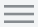
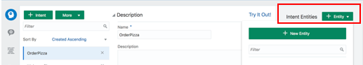
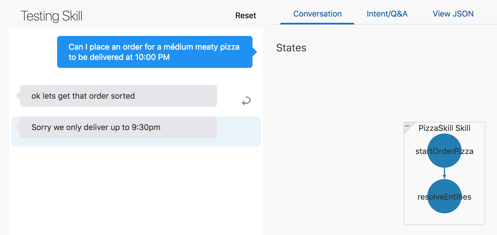

# Digital Assistant - Building a Digital Assistant for your business #

In this lab, you'll learn how to work with skills and digital assistants in Oracle Digital Assistant;
-	A **skill** is an individual chatbot that is focused on a specific set of capabilities (e.g. helping customers order food from a specific restaurant).
- **A digital assistant** is a master chatbot containing multiple specialized skills. When a user engages with the digital assistant, the digital assistant evaluates the user input and routes the conversation to the appropriate skill. You can populate your digital assistant with skills from the Skill Store and with skills you have designed yourself.

## Before you start ##

To complete this lab you need to;

- Download these files
  - [PizzaSkill_starter.zip](https://github.com/KaddeOucif/CTD-Digital-Assistant/blob/master/files/PizzaSkill_starter.zip?raw=true)
  - [PizzaSkill_BotML.json](https://github.com/KaddeOucif/CTD-Digital-Assistant/blob/master/files/PizzaSkill_BotML.json?raw=true)
  - [ODA_CTD2019.zip](https://github.com/KaddeOucif/CTD-Digital-Assistant/blob/master/files/ODA_CTD2019.zip?raw=true)
  - <details><summary> <b>Optional: Download NodeJS & the Web Client SDK to host your Digital Assistant in your machine</b> </summary>
     <b>1.</b> <a href="https://nodejs.org/en/download/">Download NodeJS here</a> <br>
     <b>2.</b> <a href="http://bit.ly/amcedownloads">Download the Web Client SDK here</a> <br>
     <i>Navigate to <b>ODA Client samples for JavaScript v18.4.3.0</b> and download the <b>bots-client-sdk-js-samples-18.4.3.zip</b> file.</i><br>
     </img>
     </details>
 
## Get on crackin'! ##

### Login to the shared instance ###
1. In your browser, navigate to http://bit.ly/DAOOW2019.
2. Log in to the instance using the credentials provided by your lab instructor.

After successfully logging in, you will find yourself on the ODA home page.

***

### 1. Clone Copies of the Starter Skill and Digital Assistant ###
In this lab, a starter skill and a starter digital assistant are provided for you. Before you get to work, you need to create your own copies.

#### Clone the Starter Skill ####
1. With the Oracle Digital Assistant UI open in your browser, click  main menu icon to open the side menu.
2. Click **Development** and select **Skills**.
3. Click  again to collapse side menu.
4. In the skills dashboard, find the tile for **PizzaSkill**.
5. Click PizzaSkill's **Options** menu () and select **Clone**.

6. In the **Create Clone** dialog, enter a value for **Display Name** using the form *<your_initials>_PizzaSkill*.
For example, if your initials are AB, you'd name the skill **AB_PizzaSkill**.
7. On the Skills dashboard page, select *<your_initials>_PizzaSkill* to open it up in the designer.

#### Clone the Digital Assistant ####
1. Click  to open the side menu.
2. Click **Development** and select **Digital Assistants**.
3. Click  again to collapse the side menu.
4. In the skills dashboard, find the tile for **ODA_CTD2019**, open its Options menu , and select **Clone**.
5. In the **Create Clone dialog**, enter a value for **Display Name** using the form <your_initials>_CTD_2019.
For example, if your initials are AB, you'd name the skill **AB_CTD_2019**.

6. Click **Clone**.
7. On the Digital Assistants dashboard page, select _<your_initials>_ODA_HOL2019_ to open it up in the designer.

***

### 2. Design your Pizza Skill ###
< Describe what we're doing this lab>

#### Explore the Corpus and test the Skill ####
1. In ODA, click  to open the side menu.
2. Click **Development** and select **Skills**.
3. Click  again to collapse the side menu.
4. In the skills dashboard, select your copy of **PizzaSkill**.
5. In the left navigation for the designer, select the .
6. Click the **OrderPizza** intent and quickly scan the utterances.
7. In the left navigation for the designer, select .
8. Select the **PizzaDough** entity and look at the way that it is configured.
9. Repeat the above step for **PizzaSize** and **PizzaTopping**.
10. Locate the **Train button**  on the right side of the page, click it, click **Submit**, and then wait a few seconds for the training to complete.
11. Find the Skill Tester  in the bottom of the skill's left navigation bar and click it.
12. In the tester's **Message** field, type *I want to order pizza*, click **Send**, and note the skill's response.
For now it's just a static response. It will become more dynamic once we add logic to the dialog flow.

13. Click the **Reset** button at the top of the tester window and then close the tester.

#### Create your Composite Bag and associate the right entities ####

1. Select  and click  to create a new entity.
2. In the **Name** field, change the value to _PizzaBag_.
3. In the Configuration section, in the Type dropdown, select **Composite Bag**.


#### Add the right entity items to your bag ####

1. Click .
2. On the Add Bag Item page, fill in the following values:
- **Name:** PizzaSize
- **Type:** Entity
- **Entity Name:** PizzaSize (If prompted in a popup, select Overwrite.)
- **Maximum User Input Attempts:** 4
- **Error Message:** ```Sorry, '${system.entityToResolve.value.userInput!'this'}' is not a valid size of pizza.```
3. Click .
4. For the value, enter ```What size of pizza would you like?```
5. Again, click .
6. For the value, enter ```Please choose small, medium or large.```
7. Click **Close**.

---

8. Again, click .
9. Click **Close**.
10. On the Add Bag Item page, fill in the following values:
- **Name:** PizzaTopping
- **Type**: Entity
- **Entity Name:** PizzaTopping (If prompted in a popup, select **Overwrite**.)
- **Error Message:** Sorry, we don't have that topping
- **Prompt for Disambiguation:** _switched ON_
- **Disambiguation Prompt:** ```Sorry you can only order one topping type```
11. Click **Close**.

---

12. Again click .
13. On the Add Bag Item page, fill in the following values:
- **Name:** PizzaDough
- **Type:** Entity
- **Entity Name:** PizzaDough
- **Out of Order Extraction:** _switched ON_
- **Prompt for Value:** false
14. Click Close.

---

15. For the fourth (and final) time, click .
16. On the Add Bag Item page, fill in the following values:
- **Name:** DeliveryTime
- **Type:** Entity
- **Entity Name:** TIME
- **Maximum User Input Attempts:** 4
17. Scroll down to the Prompts section, replace the existing prompt with ```When can we deliver that for you?```, and press Enter.
18. Click .
19. In the **Expression** field, enter ```${(pizza.value.DeliveryTime.hrs?number < 10)?then('true','false')}```.
20. In the **Error Message** field, enter ```Sorry, we only deliver up to 9:30pm``` and press the Enter key.
21. Click Close.

---

Here is what the PizzaBag composite bag should look like in the designer:


Now we need to associate the PizzaBag composite entity to the OrderPizza intent so that we can extract the key words and phrases from the user input.

22. Select .
23. Select the **OrderPizza** intent.
24. Click  button and select **PizzaBag** from the dropdown. See this screenshot to help locate the button:


#### Define the logic of your Skill ####

Now we need to define what actions the skills should take depending on the user-input. This is where we choreograph the interaction between the Skill and its end-users. 

1. Paste the YAML-code downloaded previously in [PizzaSkill_BotML.json](https://github.com/KaddeOucif/CTD-Digital-Assistant/blob/master/files/PizzaSkill_BotML.json?raw=true). We won't focus too much on what each segment in the code does in this lab, but let's go through it briefly. You can also find some additional commentary about the flow in the YAML file.

<details><summary> <b> Press here if you want to see the code </b></summary>
  
```yaml
#metadata: information about the flow
#  platformVersion: the version of the bots platform that this flow was written to work with 
metadata:
  platformVersion: 1.0
main: true
name: PizzaSkill
#context: Define the variables which will used throughout the dialog flow here.
context:
  variables:
    iResult: "nlpresult"
    pizza: "PizzaBag"
    
states:
  intent:
    component: "System.Intent"
    properties:
      variable: "iResult"
      optionsPrompt: "Do you want to"      
    transitions:
      actions:
        OrderPizza: "startOrderPizza"
        WelcomePizza: "startWelcome"
        unresolvedIntent: "startUnresolved"        

  startOrderPizza:
    component: "System.Output"
    properties:
      text: "ok lets get that order sorted"
      keepTurn: true
    transitions: {}
    
  resolveEntities:
    component: "System.ResolveEntities"
    properties:
      variable: "pizza"
      nlpResultVariable: "iResult"      
      maxPrompts: 3
      cancelPolicy: "immediate"        
    transitions:
      actions:
        cancel: "maxError"
        next: "setPizzaDough"

  setPizzaDough:
    component: "System.SetVariable"
    properties:
      variable: "pizza.PizzaDough"
      # value set for the variable.
      value: "${pizza.value.PizzaDough?has_content?then(pizza.value.PizzaDough,'regular')}"

  showPizzaOrder:
    component: "System.Output"
    properties:
      text: "Ok so we are getting you a ${pizza.value.PizzaSize} ${pizza.value.PizzaTopping} at ${pizza.value.DeliveryTime.date?long?number_to_time?string('HH:mm')}.  This will be on our ${pizza.value.PizzaDough} base "
    transitions: 
      return : "showPizzaOrder"

  startWelcome:
    component: "System.Output"
    properties:
      text: "Hey there - welcome to our online Pizza bot!"
    transitions:
      return: "startWelcome"
      
  startUnresolved:
    component: "System.Output"
    properties:
      text: "Ok lets sort out that pizza for you!"
      keepTurn: false
    transitions:
      return: "startUnresolved"      

  maxError:
    component: "System.Output"
    properties:
      text: "OK lets connect you with someone to help"
    transitions:
      return: "maxError"

  helpState:
    component: "System.Output"
    properties:
      text: "I am the pizza bot here to help you!!"
    transitions:
      return: "helpState"
```
</details> <br>

- The **resolveEntities** state calls a system component (System.ResolveEntities), iterates through all the entity fields in the composite bag, converses with the user, and resolves all the fields.
- The **setPizzaDough** state checks if the dough value is null. If yes, then it sets it to regular.
Once all the entities are resolved, we output the pizza details in the showPizzaOrder state.
- The **maxError** state is called if the number of attempts for an entity in the bag has reached the value of maxPrompts.

2. Working with your skills, the validate-button is going to be your best friend. You can find it top-right in your skill-window. If you get a green banner, then that's a good sign. A red banner is bad news, but do not worry - the platform always tells you exactly where you went wrong. If you've copied the YAML code in to the dialog flow window and followed all of the steps up until now, then the process would be very similar to the one beneath.


3. Make sure you press the  button next to the Validate button and wait for a couple of a seconds.

#### Test and Publish your Skill ####
1. Find the Skill Tester icon  in the bottom of the skill's left navigation bar and click it.
2. Type ```I want to order a medium pizza``` in the **Message** field and click **Send**.
Click the **Intent/QnA** tab and observe the Entity Matches section.
You'll notice that the _PizzaSize_ value is set to _Medium_:


_On the left side, there is a conversation between the user and the skill. On the right side, the Intent/Q&A tab is selected, there is a graph showing the OrderPizza intent having a match of 100%, and there are entity matches shown for PizzaSize and PizzaBag. For PizzaBag, it shows Value:Medium._

3. Click the **Reset** button.
5. Now try ```Can I place an order for a medium meaty pizza to be delivered at 9:00 PM``` and observe the response:


_On the left side, there is a conversation between the user and the skill. The response to the user is 'ok let's get that order sorted' and 'Ok, so we're getting you a Medium Meaty at 21:00. This will be on our regular base.' On the right side, the Conversation tab is selected, and there is a flow chart showing the sequence of states called: startOrderPizza, resolvedEntities, setPizzaDough, and showPizzaOrder._

6. Click **Reset**.
7. Now let’s try one with a gluten-free base by typing: ```A small veggie pizza to be delivered at 8:00pm, also can you please make it gluten-free?```


_On the left side, there is a conversation between the user and the skill. The response to the user is 'ok let's get that order sorted' and 'Ok, so we're getting you a Small Veggie at 20:00. This will be on our gluten free base.'_

8. Click **Reset**.
9. Now try Can I place an order for a medium meaty pizza to be delivered at 10:00 PM.
This should result in the following response:



_On the left side, there is a conversation between the user and the skill. The response to the user is 'ok let's get that order sorted' and 'Sorry, we only deliver up to 9:30 PM.' On the right side, the Conversation tab is selected, and there is a flow chart showing the sequence of states called: startOrderPizza and resolvedEntities._

10. Click **Reset**.
11. Now try ```Can I place an order for a small medium meaty pizza to be delivered at 9:00 PM``` and see what you get.
12. Click **Reset**.
13. Now try ```Can I place an order for a small sausage pizza to be delivered at 9:00 PM``` and see what you get.
14. Click **Reset**.
15. Next try ```I want a small meaty pizza.```
The skill asks at what time to deliver the pizza.

16. To see how the skill reacts when the user changes his mind mid-stream, type ```actually make it large``` and press Enter.
When the skill repeats the question about delivery time, type ```9:00 PM```.
17. This is what the conversation should look like:


_On the left side, there is a conversation between the user and the skill. After the user has entered '9:00pm', the response from the skill is 'OK so we are getting you a Large Meaty at 21:00. This will be on our regular base.'
As you can see, the skill was able to incorporate the change in the order and continue without missing a beat._

Using the composite entity, we are able to resolve all the entities in a single customer query!

18. Now that we are done building the skill, we'd like to add it to our digital assistant. However, to make the skill available to be added to a digital assistant, we first need to publish it:

19. Click  to open the side menu.
20. Click **Development** and select **Skills**.
21. Click  again to collapse the side menu.
22. In the skills dashboard, find the tile for your copy of **PizzaSkill**.
23. Click the skill's Options menu  and select **Publish**.


24. On the Publish Skills page, click **Publish**.
25. Once you have published the skill, note the icon on the skill's tile that shows it is now read-only.


Congrats! Your skill is now ready to be added to a digital assistant!

***

### 3. Set up Digital Assistant ###

Digital assistants are virtual personal assistants that users can interact with using natural language. When a user engages with the digital assistant, the digital assistant evaluates the user input and routes the conversation to the appropriate skill.

Among other things, the digital assistant:

- Greets the user upon access.
- Upon user request, lists what it can do and provides entry points into the given skills.
- Routes explicit user requests to the appropriate skill.
- Handles interruptions to flows.
- Handles disambiguation.
- Handles requests to exit the bot.

#### Explore the Digital Assistant ####
The starter digital assistant (or, DA for short) that you just cloned consists of two skills – FinancialBot and RetailBot. Later, we'll add PizzaSkill to the DA.

To familiarize yourself with the DA, try it out by following these steps:

1. Click main menu icon to open the side menu.
2. Click Development and select Digital Assistants.
3. Click main menu icon again to collapse the side menu.
4. On the Digital Assistants dashboard, find the tile for your copy of ODA_HOL2019 and select it to open it up in the designer.
5. Ensure the Skills icon is selected (the Skills icon).
Notice that FinancialBot and RetailBot are listed there.

6. Select the RetailBot skill and browse the attributes of its description and interaction model.
7. Select the FinancialBot skill and browse the attributes of its description and interaction model.
8. Select the Intents icon.
9. Note the three intents.
These are built in to all digital assistants. Here's what they are for:

- **exit:** applies when the user signals the desire to exit the current conversation or context in the digital assistant.
- **help:** applies when the user asks for help or orientation.
- **unresolvedIntent:** applies to user input that doesn't match well with the exit and help intents.
10. Click the Settings icon and select the Configurations tab.
Notice the Routing Parameters, Conversation Parameters and Other Parameters sections.

11. Click Train bot icon, click Submit, and then wait a few seconds for the training to complete.
12. Find the tester icon (the Digital Assistant Tester icon) in the bottom of the DA's left navigation bar and click it.
13. In the tester's Message field, type help me, press Enter, and note the DA's greeting and initial menu.
14. Click the Reset button.
15. Now try entering Do I have enough money in my savings account, pressing Enter, and observing the response.
16. Close the tester.

#### Add PizzaSkill to the DA ####

With a new pizzeria opening in the shopping centre, we want the digital assistant to support this merchant as well. So let's add the PizzaSkill to our digital assistant and then train the digital assistant so that it can work with the new skill:

1. In your DA, select the Skills icon.
2. Click Add Skill button.
3. Find the tile for your copy of PizzaSkill.
Note: The skill won't appear there if you haven't completed the Publish the Skill part of the lab.

4. In the tile for your skill, click Add Skill icon.
5. Click Close to close the Skill Catalog.
6. Click Train bot icon, click Submit, and then wait a few seconds for the training to complete.

### 4. Evaluate routing behaviors ###
Before putting the digital assistant into production, let’s use the tester to evaluate various aspects of its routing behavior.

Open the tester by clicking the tester icon (the Digital Assistant Tester icon).

#### No Match ####
In the tester's Message field, type I want a burger and press Enter.
Since no match is found in the DA and skill, it generates the DA-level help card:

Screenshot showing the digital assistant tester. After the user input ('I want a burger') is the DA's response (The text 'No matches were found. Here are some things you can do.' followed by a card for Pizza King with the 'Order Pizza' option.)
Note: Only the Pizza King shows in the screenshot, but you can use the horizontal scroll arrows to see the cards for the other skills.

Click Reset.
#### Implicit Invocation ####
In the tester's Message field, type Send money and press Enter.
Notice that the routing resolves to the Digital Bank candidate skill and its Send Money intent:

Screenshot showing the digital assistant tester. After the user input ('Send money') is the DA's response (The text 'From which account do you want to make a payment' followed by options for savings, checking, and credit card.)
Note: "Digital Bank" is the invocation name of FinancialBot.

Click the Routing tab and scroll down.
Notice the intent evaluation that leads to this response:

Screenshot showing the Intent Calls section of the Routing tab of the DA tester. In the Candidate Skills row , the Digital Bank skill is circled. In the Candidate Flows row, the Send Money intent is circled.
Click Reset.
Note: In these examples, you might get slightly different results than what are shown here, especially in the confidences scores (given in percentages) when resolving intents. And in some cases, the resolved intents could vary, should the differing confidence scores push those intents above or below the given confidence thresholds. The cause of this variance is the non-deterministic nature of the AI behind the natural language processing and the fact that these bots have a limited number of training utterances (in order to make the lab simpler).

#### Explicit Invocation ####
In the tester's Message field, type I want to send money from Digital Bank and press Enter.
Here’s the user’s input and the digital assistant’s initial response:

Screenshot showing the digital assistant tester. After the user input ('I want to send money from Digital Bank') is the DA's response (The text 'From which account do you want to make a payment' followed by options for savings, checking, and credit card.)
Click the Routing tab and scroll down to the Rules section and notice the rule that is displayed.
Screenshot showing the Rules section of the Routing tab of the DA tester. The rule displayed reads 'Explicit invocation takes precedence over other flows in digital assistant context.'
In the Intent Calls section, you can see that the Digital Bank skill gets a much higher confidence score than the other skills.

Screenshot showing the Intent Calls section of the Routing tab of the DA tester. In the Candidate Skills row , the Digital Bank skill is circled. In the Candidate Flows row, the Send Money intent is circled.
Click Reset.

#### Ambiguous Utterance ####
In the tester's Message field, type What is my balance? and press Enter.
Here’s the conversation:

Screenshot showing the digital assistant tester. After the user input ('What is my balance?') is the DA's response (The text 'Do you want to go to:' followed by options for GiftCardBalance in Sport Store, Balances in Digital Bank, and None of the above.)
As you can see, the digital assistant is unsure of what the user wants to do, so it provides a prompt asking the user to choose among the Sport Store (which is the invocation name for the RetailBot skill) and Digital Bank skill intents.

Click the Routing tab and scroll down.
Notice the evaluation in the Intent Calls section that leads to this response:

Screenshot showing the Intent Calls section of the Routing tab of the DA tester. The significant details are described in the ensuing text.
Both the candidate skills got high scores (100%). And then for each of those skills, the router identified a candidate flow that also scored highly (also 100%).

Since the GiftCardBalance and Balances candidate flows exceed the confidence threshold, and since difference between their scores is less than the Confidence Win Margin value (10%), the digital assistant asks the user to choose between those intents.

Click Reset.
#### Context Awareness ####
In the tester, type What is my balance? and press Enter.
Here’s the conversation:

Screenshot showing the digital assistant tester. After the user input ('What is my balance?') is the DA's response (The text 'Do you want to go to:' followed by options for GiftCardBalance in Sport Store, Balances in Digital Bank, and None of the above.)
Select Balances in Digital Bank.
Screenshot showing the digital assistant tester. After the user input ('Balances in Digital Bank') is the DA's response (The text 'For which account do you want your balance' followed by options for savings, checking, and credit card.)
Select checking.
Screenshot showing the digital assistant tester. After the user input ('checking') is the DA's response ('The balance in your checking account (903423-123) is $2334.56')
.
Again, type How much do I have in my savings?
Here is the response:

Screenshot showing the digital assistant tester. After the user input ('How much do I have in my savings') is the DA's response ('The balance in your savings account (258293-832) is $2610.56')
.
Click Reset.
###### Notes on What We Just Did ######
As you can see, the user starts with the question "What is my balance?", goes through a prompt to disambiguate between the Digital Bank skill and the Sport Store skill, and eventually gets her checking account balance. Then the user enters "What is my balance?" again, but this time doesn't have to navigate through any disambiguation prompts. The info in the Routing tab helps to explain why.

Also note that in the Rules section of the Routing tab, you see the following:

Screenshot of the Rules section of the Routing tab. It shows the detail 'Current context matches with very high confidence. Other skill flows are ignored.'
So, even though there are matching intents from the Sport Store skill, they are ignored. The Intent Calls section shows all of the matching intents, but the entry for “Current Context”, which contains only the Digital Bank skill’s Balances intent, is decisive.

Screenshot showing the Intent Calls section of the Routing tab of the DA tester. For Candidate Skills, Digital Bank and Sports Store match. For Current Context, Digital Bank's Balances intent matches. For Candidate Flows, Digital Bank's Balances intent matches.
#### Non sequitur ####
Non sequitur refers to interrupting a conversation flow by changing the subject. Here's an example where such interruptions occur because the user needs info from one skill to complete the flow in another skill.

In the tester, type I want to order a small meaty pizza and press Enter.
Pizza Skill is invoked and here is the response:

Screenshot showing the digital assistant tester. After the user input ('I want to order a small meaty pizza') is the DA's response ('ok lets get that order sorted' followed by 'When can we deliver that for you?')
To simulate the user suddenly being unsure if he has enough money, type the following: oh, do I have enough money on my credit card?
At this point the DA detects that the intent corresponds to the Digital Bank skill and asks if user wants to switch to Balances in Digital Bank:

Screenshot showing the digital assistant tester. After the user input ('oh, do I have enough money on my credit card?') is the DA's response ('Do you want to switch to Balances in Digital Bank now' followed by Yes and No options.
Select Yes.
 Screenshot showing the digital assistant tester. After the user input ('Yes') is the DA's response ('The balance in your credit card account (4352-3423-1234-5239) is $-208.88' followed by 'Your remaining credit is $4791.12' followed by 'Do you want to resume OrderPizza in Pizza King now?' followed by Yes and No options.
The user is presented with his financial details, thus completing that flow. At that point, the DA asks if it can return back to PizzaSkill.

Again, select Yes.
Screenshot showing the digital assistant tester. After the user input ('Yes') is the DA's response ('When can we deliver that for you')
The DA returns to PizzaSkill and resumes the conversation where you left it:

Type 9:00 PM and press Enter.
Screenshot showing the digital assistant tester. After the user input ('9:00 PM') is the DA's response ('Ok so we are getting you a Small Meaty at 21:00. This will be on our regular base')
In this sequence, you started ordering a pizza, confirmed you had enough money in your account, and finished ordering the pizza.

#### Non sequitur – Complex Conversation ####
Let’s try a more complex conversation:

In the tester, type I want to order a large pizza at 9:00 PM today and press Enter.
Instead of selecting the kind of pizza, type oh, do I have enough money?
At this point, the DA will ask you to switch to Balance in Digital Bank.

Select Yes.
Now, instead of selecting the account type, type how about my gift card balance?
The DA asks if you want to switch to GiftCardBalance in Sport Store.

Select Yes.
Type GC100 as the gift card number and press Enter.
The DA informs you of your gift card balance.

Then the DA asks if you want to return to Balance in Digital Bank.

Select Yes.
Select savings as your account type.
The DA fetches the savings account details for you and asks if you want to return to OrderPizza in Pizza King.

Select Yes.
Select any of the options for the kind of pizza you want to order.
Observe the states flow in the Conversation tab.
Screenshot showing the Conversation tab of the digital assistant tester. Through a flow chart it depicts the states invoked in the DA in the following order: startOrderPizza, resolveEntities, startBalances (switch to Financial Bot), askBalancesAccountType, startGiftCardBalance (switch to RetailBot), setPizzaDough (switch to PizzaSkill), and showPizzaOrder.
You are now done with creating, personalizing, and evaluating the routing behavior of your digital assistant! In the next section, we'll add it to a web channel through which users can access it.
